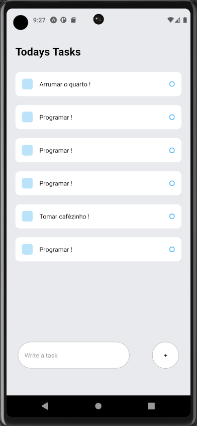

<h1 id="titulo" align="center"> TODO - LISTA DE TAREFAS </h1>

 

  

 

# Índice 

* [Título e Imagem de capa](#titulo)
* [Badges](#badges)
* [Índice](#índice)
* [Descrição do Projeto](#descrição-do-projeto)
* [Status do Projeto](#status-do-projeto)
* [Funcionalidades e Demonstração da Aplicação](#funcionalidades-e-demonstração-da-aplicação)
* [Tecnologias utilizadas](#tecnologias-utilizadas)
* [Conclusão](#conclusão)

 

# Descrição do projeto

  Esse é um projeto teste de lista de tarefas ( TODO List ) utilizando componentização e gerenciamento de estados com React Native.

 

# Status do projeto

  O projeto encontra-se com desenvolvimento concluído

 

# Funcionalidades e Demonstração da Aplicação

  

 
 

  ✅ Adiciona Tarefa.  
  ✅ Remove a tarefa (Conclui) ao clicar nela.  
   

 

# Tecnologias utilizadas
 

  

 

# Conclusão

Esse projeto foi feito com muito ❤️ e ☕ por Igor Flores
  
Outros projetos: <a href="https://igorfloresdev.vercel.app">igorfloresdev.vercel.app

